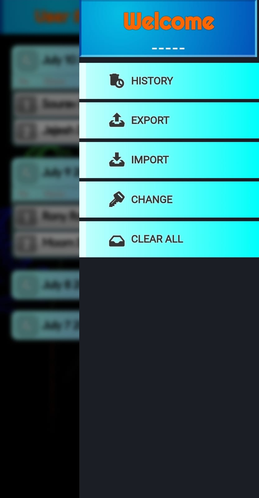
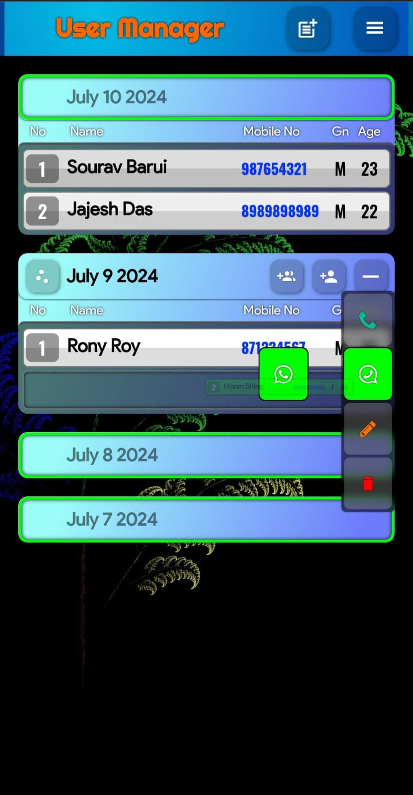
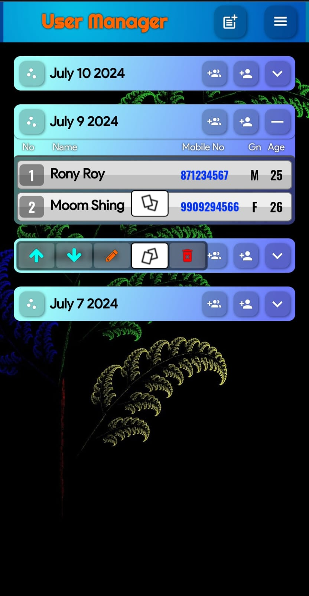
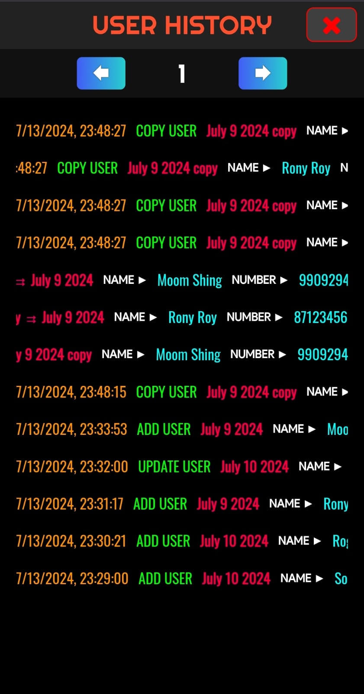

<h1 align="center"> [User Manager](https://elsesourav.github.io/user-manager) </h1>

 ## `Overview`
 > The User Manager app is user friendly. Aims to simplify the management of users and groups. It provides a way to add delete users create groups and organize them effortlessly using drag and drop features. Open WhatsApp in Particular User, Run on both web and Android platforms. Best for **Network Marketing**.

## `Features`
> - **Drag-and-Drop Functionality:** Intuitive drag-and-drop interface for organizing users and groups.
> - **User Management:** Easily add, rename, or remove users.
> - **Group Management:** Create, manage, and organize groups effortlessly.
> - **WhatsApp Integration:** Integrated messaging through WhatsApp for seamless communication.
> - **Secure Cloud Storage:** Safely store and manage user and group data in the cloud.
> - **Cross-Platform Access** Access the app from web and Android platforms

 

## `Technical Challenges and Optimizations`
### Drag and Drop Functionality
> Implementing drag and drop features required handling event management processes and state synchronization. Achieving operation of drag and drop actions necessitated optimization techniques coupled with extensive testing efforts.

## `Screenshot`
<table>
  <tr>
    <td>
      
    </td>
    <td>
      
    </td>
  </tr>
  <tr>
    <td>
      
    </td>
    <td>
      
    </td>
  </tr>
</table>

## `Compatibility`
### Web Platform: Access the app from any modern web browser.
### Android Platform: [Click to Download the App.]()

## `License`

### This project is licensed under the [MIT License](./LICENSE.md).

## `Contact`

### For questions or feedback, please contact me

-  [Email](https://elsesourav@gmail.com)
-  [Twitter](https://twitter.com/elsesourav)
-  [Linkedin](https://linkedin.com/in/elsesourav)
-  [Facebook](https://fb.com/elsesourav)
-  [Instagram](https://instagram.com/elsesourav)

 

[<h2 align="center"> Open App </h2>](https://elsesourav.github.io/user-manager)